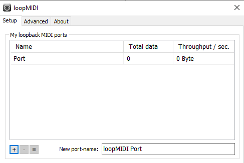
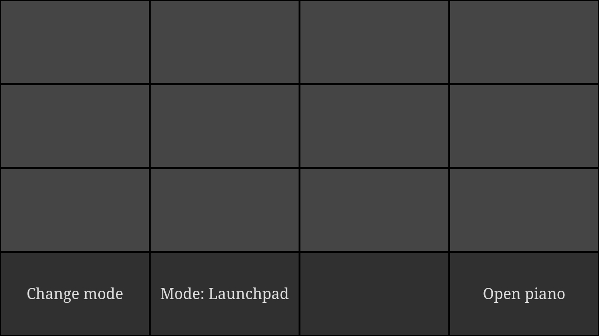
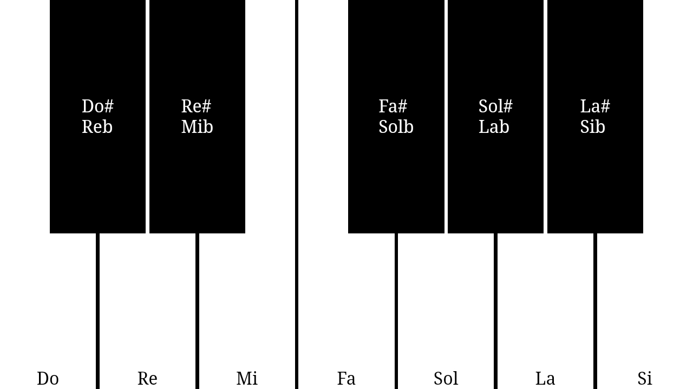

# MIDI Controller

MIDI Controller is, as his name says, a midi controller (launchpad and piano) for Android to control a virtual synth (like [LMMS](https://lmms.io) Instrument). Has been designed to keep things simple. Is a PWA but only for letting the app run in full screen.

This should works in Windows and Linux, but has not been tested in Linux.

### Installing

#### - loopMIDI

The program will try to connect to a MIDI Outport. For that purpose we need to create a virtual port. Because Mido can't create virtual ports in Windows, [loopMIDI](https://www.tobias-erichsen.de/software/loopmidi.html) by Tobias Erichsen is the solution. Just install it, I will explain later what to do with it.

####  - Requirements

In order to install the dependencies, execute this command:

`pip install -r requirements.txt`

You will need [Microsoft Visual C++ Compiler 14.x](https://visualstudio.microsoft.com/en/downloads/) in order to compile python-rtmidi. The installer is in Microsoft Build Tools for Visual Studio 2019.

### Running the server

First you must run loopMIDI. Write the name of your port at bottom right. Then click in the + symbol.
You will know the port is running when it appears in the list.



Open cmd or PowerShell and navigate to directory. Then run: `py main.py`.
It will show you all ports like:

```
Select port: 
 - Microsoft GS Wavetable Synth 0
 - Port 1
Port:
```

Just type the your port's name and hit enter. Then, server will be live in your local address. Remember to know your IP and create a rule in the firewall.

### Accesing the app

The app uses touch events, so it does not work in computer navigators. Just go your PC's address in your Android phone using Chrome. Then add to the home screen.

Congrats. Your app is ready to run.

Configure your favourite synth to the port created previously and enjoy.

## Screenshots

 